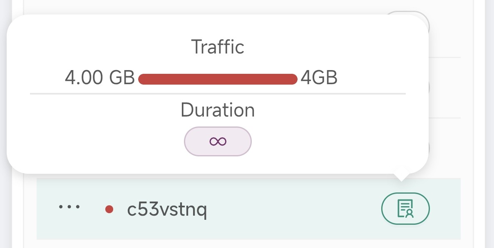
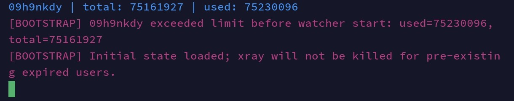

# WatcherV2
Smart x-ui traffic watcher with safe startup bootstrap



# Important Warning

**The only official version of watcherV2 is available through this GitHub page.
Do not use other versions shared in different telegram channels or hosted on other GitHub pages, as the risk of scams and theft is extremely high** ⚠️

---

# x-ui Expire Watcher

A smart traffic watcher for x-ui panels (only).

watcherV2 is an open source project that watches your x-ui traffic database directly and restarts xray when a client exceeds their total quota.

---

# Features of the watcherV2

* wont crack under high pressure 
* Safe startup bootstrap
* Colored logs
* restarts xray instead of the x-ui
* Lightweight polling
* Expired Clients removed from main loop
* Automatic recheck system
* Doesn't spam xray restarts

---

# How This Thing Works

The script reads this database:

```bash
/etc/x-ui/x-ui.db
```

It checks:

```text
used traffic > total quota
```

If a client exceeded the quota:

* user gets marked as expired
* xray gets restarted
* expired user will be disconnected.

Simple. Efficient.

---

# Installation

## Method 1 — Screen :


### 1. Download the Script
you can download watcherV2 from [Releases](https://github.com/rick-sanchez-io/WatcherV2/releases/tag/v2.0.0)

---

### 2. upload watcher to your server

Example:

upload it to :
```bash
/root/watcher2.py
```

---

### 3. Make a screen

```bash
screen -S watcher
```
---

### 4. start watcher

```bash
sudo python3 watcher2.py
```

*If you see colored logs, Congratulations.*

---

## Method 2 — Systemd Service

*Because running scripts manually forever is caveman behavior.*

---

### 1. Create Service File

```bash
nano /etc/systemd/system/watcher.service
```

Paste this:

```ini
[Unit]
Description=x-ui Expire Watcher
After=network.target

[Service]
Type=simple
ExecStart=/usr/bin/python3 /root/watcher2.py
Restart=always
RestartSec=3

[Install]
WantedBy=multi-user.target
```

---

### 2. Reload systemd

```bash
systemctl daemon-reload
```

---

### 3. Enable Service

```bash
systemctl enable watcher
```

---

### 4. Start Service

```bash
systemctl start watcher
```

---

### 5. View Logs

```bash
journalctl -u watcher -f
```


*Now the server babysits the watcher for you.*

---

# Why is this script effective?

Based on the tests performed, this script has an error margin of around 1 to 10 MB per user, and in the worst-case scenario, around 20 to 30 MB.
It can easily be used for panels with a large number of users.


*as you can see in the image , the error rate was 68169 bytes ( 68.169 KB )*
